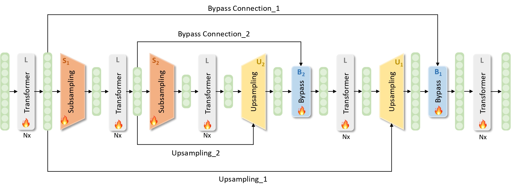

# SUBLLM

This repository is the official implementation of the ECAI 2024 conference paper [**SUBLLM: A Novel Efficient Architecture with Token Sequence Subsampling for LLM**](https://arxiv.org/abs/2406.06571)



## News and Updates
* 2024.8.13 We release the model inference code, including the streaming inference and few-shot evaluation codes, and the model structure of SUBLLM to help better understand its module details.

## Evaluation
The test results on benchmarks of training a 1.3B model with a training window length of 4k.
| Model             |   MMLU   |  BBH  |  AGIEval   |
|:------------------|:--------:|:--------:|:--------:|
|                   |  5-shot  |  3-shot  |  5-shot  |
| LLaMA         |   26.23   |   23.70  |   16.76   |
| SUBLLM        |   **26.41**   |   **24.17**   |   **17.64**  |

## Stream Inference 

```shell 
cd inference 
sh infer.sh
```

## Fewshot

```shell
# data preparation 
cd fewshot_eval
python download_data.py 
# run fewshot task
sh fewshot.sh $MODEL_PATH $CONFIG_PATH $TOKENIZER_PATH $RSLT_PATH $MAX_LEN $TASK $N_SHOT
```


## Citations
Please cite the paper if this repository is useful for you.

```bibtex
@article{wang2024subllm,
      title={SUBLLM: A Novel Efficient Architecture with Token Sequence Subsampling for LLM}, 
      author={Quandong Wang and Yuxuan Yuan and Xiaoyu Yang and Ruike Zhang and Kang Zhao and Wei Liu and Jian Luan and Daniel Povey and Bin Wang},
      journal={arXiv preprint arXiv:2406.06571},
      year={2024},
}
```